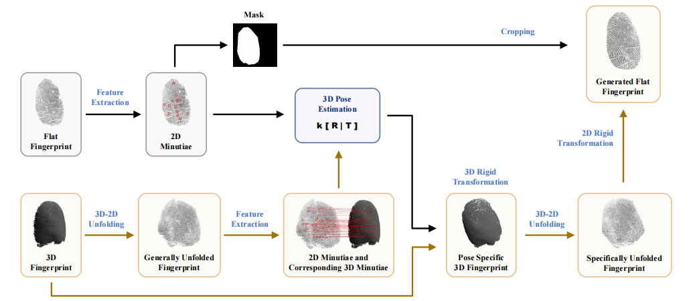
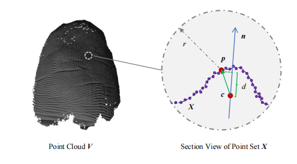

<!--
 * @Description:
 * @Author: Xiongjun Guan
 * @Date: 2026-06-08
 * @version: 0.0.1
-->

# 3DFpVisual

<h5 align="left"> If our project helps you, please give us a star ⭐ on GitHub to support us. 🙏🙏 </h2>

<br>

  

### :speech_balloon: This repository is a partial code release related to:

- **_Arxiv 2026_**: **Cross-Modal Registration Between 3D and 2D Fingerprints via Pose-Aware Unwrapping and Point-Cloud Fusion**
- **_CCBR 2021_**: **Pose-Specific 3D Fingerprint Unfolding**

<a href="https://arxiv.org/pdf/2605.15796" style="text-decoration: none;"></a>
<a href="https://arxiv.org/pdf/2404.17149" style="text-decoration: none;"></a>

[Xiongjun Guan](https://xiongjunguan.github.io/), Jianjiang Feng, Jie Zhou


---

## :art: Introduction

We study the preprocessing stage of 3D fingerprint recognition, with the goal of transforming a 3D fingerprint point cloud into a 2D representation that is more compatible with traditional fingerprint pipelines. The overall process is illustrated below.

<p align="center">
     <br />
</p>

This repository contains the original Python and MATLAB implementations for several core components used during development:

- point-cloud preprocessing
- local surface normal and depth estimation
- geometric visualization of 3D fingerprints
- nonparametric 3D-to-2D unwrapping


Unlike global shape-model-based methods, this code mainly follows a geometry-driven pipeline that works directly on local point-cloud structure. The local surface-depth visualization strategy is illustrated below:

<p align="center">
     <br />
</p>

<br>

### :pushpin: Scope of this repository

This repository mainly corresponds to the **preprocessing and unwrapping** part of the full framework in the paper.

It currently does **not** include a complete public reproduction package for:

- the full point-cloud fusion pipeline
- the complete cross-modal registration experiments
- all figures, evaluation scripts, and experimental datasets used in the paper

<br>

## :open_file_folder: Repository Structure

```text
3DFpVisual_GitHub/
|- README.md
|- .gitignore
|- python/
|  |- data/
|  |  |- 100_1_2.mat
|  |- flatten/
|  |  |- Flatten3d.py
|  |  |- Functions.py
|  |- preprocess/
|  |  |- PtPreprocess.py
|  |  |- PtFunctions.py
|  |  |- stl2mat.m
|  |- requirements.txt
|- matlab/
   |- data/
   |  |- 100_1_2.mat
   |- main.m
   |- GeneratePoseData.m
   |- VisualizeVerts.m
   |- ImgPos2Flat.m
   |- curve_flat.m
   |- GetEulerMatrix.m
   |- stl2mat.m
```

<br>

## :bookmark_tabs: Data Format

The example `.mat` files typically contain:

```text
{
    "points":  Nx3  # 3D point coordinates
    "normals": Nx3  # point-wise normal vectors
    "depth":   Nx1  # point-wise local surface depth
}
```

<br>

## :wrench: Requirements

Install Python dependencies with:

```bash
pip install -r python/requirements.txt
```

Current dependency list:

```text
imageio
matplotlib
numpy
open3d
scikit-image
scikit-learn
scipy
tqdm
```

<br>

## :rocket: Python Usage

### :pushpin: 1. 3D-to-2D unwrapping

The main Python demo is:

```text
python/flatten/Flatten3d.py
```

By default, it reads:

```text
python/data/100_1_2.mat
```

and writes results to:

```text
python/results/
```

Run:

```bash
cd python/flatten
python Flatten3d.py
```

You can also specify the input file and output directory:

```bash
python Flatten3d.py -i ../data/100_1_2.mat -o ../results
```

Useful arguments:

- `--dpi` or `-d`: output image resolution, default `500`
- `--edge` or `-e`: blank image margin in pixels, default `30`
- `--brightness` or `-b`: image brightness factor, default `0.6`

Output:

- unwrapped fingerprint image in `.png`
- processed result in `.mat`

### :pushpin: 2. Point-cloud preprocessing

The preprocessing entry script is:

```text
python/preprocess/PtPreprocess.py
```

This module is used for batch processing of `.mat` point-cloud files, including:

- point-cloud segmentation
- normal estimation
- local surface-depth computation
- optional pose rotation

Example:

```bash
cd python/preprocess
python PtPreprocess.py <data_dir> <tmp_dir> <save_dir> --pitch 0 --yaw 180 --roll -90
```

<br>

## :computer: MATLAB Usage

The MATLAB entry script is:

```matlab
matlab/main.m
```

It has been adjusted to use relative paths. By default it reads from:

```text
matlab/data/
```

and writes results to:

```text
matlab/results/
```

Main functionality:

- 3D fingerprint projection
- depth-based visualization
- generation of unwrapped 2D fingerprints under different poses

To run:

1. Open `matlab/main.m` in MATLAB.
2. Make sure the `matlab/` folder is on the MATLAB path.
3. Run `main`.

<br>


## :bookmark_tabs: Citation

If you find this repository useful, please give us stars and use the following BibTeX entry for citation.


```text
@misc{guan2026crossmodal,
      title={Cross-Modal Registration Between 3D and 2D Fingerprints via Pose-Aware Unwrapping and Point-Cloud Fusion}, 
      author={Xiongjun Guan and Jianjiang Feng and Jie Zhou},
      year={2026},
      eprint={2605.15796},
      archivePrefix={arXiv},
      primaryClass={cs.CV},
      url={https://arxiv.org/abs/2605.15796}, 
}

@inproceedings{guan2021pose,
  title={Pose-specific 3D fingerprint unfolding},
  author={Guan, Xiongjun and Feng, Jianjiang and Zhou, Jie},
  booktitle={Chinese Conference on Biometric Recognition},
  pages={185--194},
  year={2021},
  organization={Springer}
}
```


<br>

## :triangular_flag_on_post: License

This project is released under the MIT license. Please see the LICENSE file for more information.

<br>

---

## :mailbox: Contact Me

If you have any questions about the code, please contact:
Xiongjun Guan gxj21@mails.tsinghua.edu.cn
